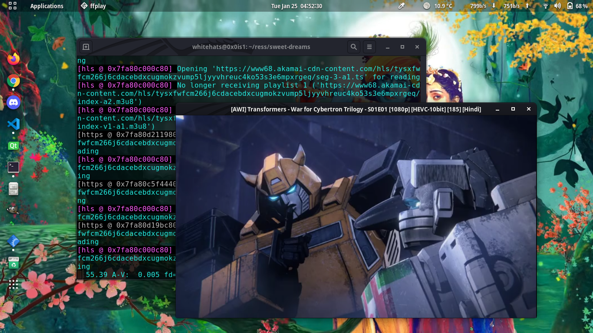

# Sweet dreams: Most of your childhood shows


[](https://saythanks.io/to/0x0is1)

Command line interface to watch your childhood shows in hindi and english, designed with python

## Installation

```sh
    # for linux
    $ apt-get install ffplay
    # for windows, download binary of ffplay, idk

    $ git clone https://github.com/0x0is1/sweet-dreams
    $ cd sweet-dreams
    $ python3 -m pip install -r requirements.txt --user
    $ python3 sd.py
```

## Requirements
* Python3.1+
* Requests (python)
* Beautiful Soup (python)
* Base64 (python)
* ffplay (ffmpeg)

## Shows on the app

> `Movies` and `Series` both are available for all shows

* Ben 10
* Transformers
* Slugterra
* Miraculous
* Avengers
* Spiderman
* Iron Man
* Tales of Arcadia
* Pokemon
* Shinchan
* Doraemon
* Ninja Hattori
* Beyblade

# Previews




## Contribution
Please consider submitting issue, pull requests, and feedbacks

## Contributors (specially thankful)
* [Kyrus](https://github.com/ShrimantaGarain)
* [Surya](https://github.com/0x0is1)

### **Support authors**:

[](https://www.buymeacoffee.com/6dciIwk)

[](https://paypal.me/0x0is1?locale.x=en_GB)
